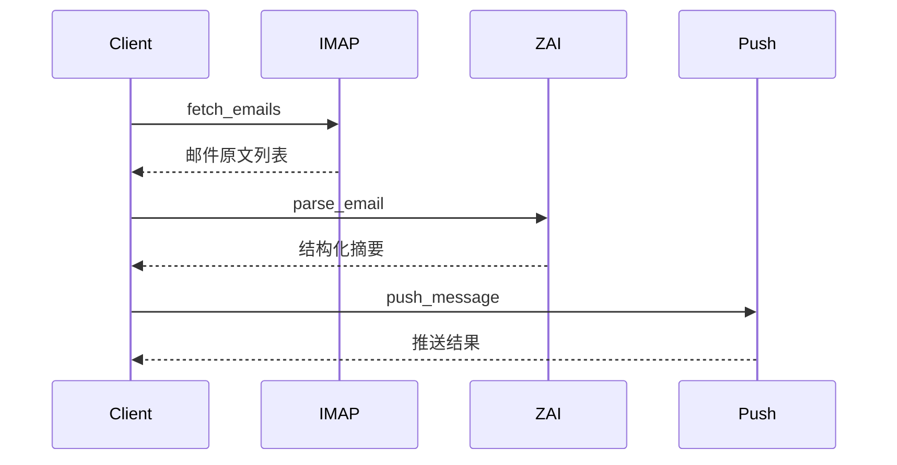

# AI自动邮件解析项目API接口细化设计

---

## 1. IMAP邮件拉取模块

### 1.1 功能说明
连接Outlook邮箱，通过IMAP协议定时拉取新邮件，支持多账号、断点续拉与去重。

### 1.2 接口定义

#### fetch_emails
- 拉取指定邮箱的新邮件列表
- **请求参数**：
  - email：邮箱账号
  - password：邮箱密码
  - imap_server：IMAP服务器地址
  - port：端口号
  - fetch_interval：拉取周期（秒）
  - last_uid：上次拉取的邮件UID（断点续拉）

---

## 2. z.ai邮件解析模块

### 2.1 功能说明
调用z.ai智能解析API，对邮件原文进行结构化摘要与关键信息提取，支持多语言与附件场景。

### 2.2 接口定义

#### parse_email
- 解析邮件内容，生成结构化摘要
- **请求参数**：
  - email：邮件原文（含主题、正文、附件）
  - language：邮件语言（可选）

---

## 3. 消息推送模块

### 3.1 功能说明
将解析后的邮件摘要通过Server酱等推送服务发送至用户微信，支持推送失败重试与日志记录。

### 3.2 接口定义

#### push_message
- 推送邮件摘要信息
- **请求参数**：
  - summary：邮件摘要信息
  - push_channel：推送渠道（如serverchan、wechat、dingding）

---

## 4. 接口调用流程Mermaid图

---

## 5. 总结

本次API接口细化设计涵盖IMAP邮件拉取、z.ai邮件解析、消息推送三大核心模块，明确了各接口的功能与参数，便于后续开发与对接。
